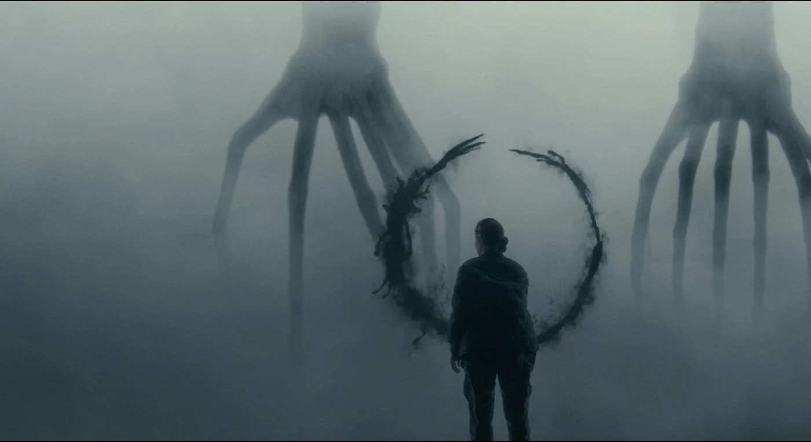

{width=100%}

Released to critical acclaim in 2016, _Arrival_ is a science fiction film that highlights the perspective of linguistics professor Dr. Louise Banks (Amy Adams), who has the unenviable duty of communicating with foreign visitors to Earth and simultaneously preventing war between its suspicious nation-states. In this quest, she works alongside theoretical physicist and future husband Ian Donnelly (Jeremy Renner) after they are recruited by Colonel Weber (Forest Whitaker) of the U.S. military.

The film's metaphors range in their explicitness from subtle to very direct, and as such the movie has spawned no short list of critical reviews (including this one) which are eager to expand upon ideas that director Denis Villeneuve weaved seamlessly together into a single 116 minute narrative. While most of the film's underlying meaning pushes audiences to consider the transience of life and the power of language, the movie also has clear political metaphors, and it offers a message to realist theorists of international relations: you assume too much.

When the aliens first arrive, we are shown the breakdown of human society: protests in the streets of Washington, violence in the capital of Venezuela, and public schools and universities rendered vacant. The media is hyper-fixated on the reticent government response, and the government for its part remains tight-lipped in its interactions with the public. When Louise is recruited by the U.S. Army, she is told very directly that her (and the government's) top priority is to figure out who these aliens are and what they want.

## Image Here

At first glance, this response may seem entirely rational given what we do know about these potential invaders: the aliens look like octopi-meets tree root-meets gigantic human hand, they sound like whales, and they fly around in massive metal bean-pods. What could be more terrifying? Perhaps, as some of the extremist media commentators in the film suggested, the U.S. government should act first to secure its citizens safety and ask questions later.

But this line of thinking is seriously flawed, and more than that - it poignantly represents the dangers of humanity's tendency for xenophobia, suspicion, and fear in light of the unknown intentions of foreign actors. Realists argue that this suspicion in the international arena is not only justified but necessary, because they assume humans (and thereby states, which are a human social construction) are, above all else, concerned with survival, relative gains in power, and the uncertainty of an anarchic international system. This line of thinking appears to have been persuasive to the top U.S. decision-makers in the film, who decide to cut all communications with other nations once they learn the aliens want to "offer" humanity a "weapon."

## Image Here

By this point in the film, the plot has really picked up pace, and I did not really think much about this decision the first time I watched it. Of course - the U.S. should be fearful and suspicious if a technologically advanced race of aliens wants to bring a weapon to Earth, a planet with no single political leader and an international system based on anarchy. It would be foolhardy to risk talking to other suspicious, self-interested states, them figuring out about this weapon, and everyone potentially triggering a war over who gets to control it. Right?

. . . Not really. As Alexander Wendt describes in his [aptly named 1992 article](https://www.mtholyoke.edu/acad/intrel/pol116/wendt.htm), "Anarchy is what States Make of it," anarchy is not a structural characteristic of an unchangeable international landscape. Rather, it is a function of human interaction, socially contrived assumptions, and agreed-upon patterns of acceptable behavior. At the end of his article, Wendt describes how our interactions with a hypothetical alien civilization would be determined by a process of signaling, interpreting, and responding until we had constructed an identity for the aliens based on patterns of perceived behavior.

This is exactly what happens in the first half of *Arrival*, with every nation (including trigger-happy China) at least making some effort to understand the aliens' intentions and communicate with each other before acting aggressively to secure their own survival. This example clearly illustrates the socially constructed nature of anarchy: put in an extreme situation with unknown actors, states opened communications channels with both each other and the potential invaders in order to determine their intentions and reduce uncertainty.

Importantly, this interpretation in the beginning of the film did not *ignore* humanity's predisposition towards fear - it *embraced* it. By the second half of the movie, after the aliens indicate that their purpose is to "offer weapon," humanity's defining traits and cynical assumptions start to show through. As prospects grow increasingly dim for peace, the contrast between the constructivist mindset and the realist mindset can best be seen through Louise's interactions with U.S. military officers. While the colonel and CIA agent Halpern give orders to prepare for retaliation after some rogue soldiers set off a bomb in the aliens' pod, Louise advocates for more - not less - communication and transparency with the unknown entities. After perceiving that the aliens want to 'offer' a 'weapon,' Louise - well aware of how easy it may be to misinterpret an unknown language and sensitive to the political effects of such an error - advocates for communication with other nations in exchange for any information they may have, in order to paint a fuller picture and reduce uncertainty. Unfortunately, the army decides to follow the course of action dictated by realist assumptions of relative gains, and it cuts communication with ally nations.

## Two images here

The film hints at several examples of why precisely that the U.S. made the wrong choice. For instance, China interpreted what was likely the same communication by the aliens as "use weapon" instead of "offer weapon," an implication that Louise was right about how easy misinterpretation can be. Moreover, once Louise learns to fully understand the alien language, she perceives Costello saying "offer *gift*" - because of course, the alien language was never a weapon in the first place, but rather a gift to us. Simple misperceptions and miscalculations nearly led to world war in *Arrival*, not because such conflict was endemic to the anarchic system, but because *humanity failed to listen*. By being conscious of our own logical pitfalls and fearful predispositions - like Louise was - we can avoid unnecessary conflict with non-aggressive actors. This is the moral of *Arrival*.

So what exactly was the aliens' "gift" to humanity, and what is this film trying to tell us about international relations? These two questions are, unironically, inseparable. At the most basic level, the Heptapods' gift to humanity was their language - woohoo, we get to read circular ink symbols. But, of course, the movie illustrates how the gift was so much more than that. In keeping with its thematic focus on the power of language, once Louise learns the foreign language, she also learns  how to 'think' like a Heptapod, and this unlocks a whole new perspective on reality. It seems arguable that part of this perspective includes a preference for peaceful discussion and a reluctance to assume threatening behavior in uncertain situations. After-all, even after humans set off an explosion in the alien ship and *killed* a member of their species, they did not retaliate and instead proceeded to give Louise their prized gift. Furthermore, in one of Louise's "flashbacks to the future," she appears to be at a United Nations conference, and a large flag with a Heptapod symbol can be seen beside the smaller flags of several states: a clear reference to greater unity in the aftermath of the aliens' arrival.  

## Image here

The Heptapods' gift to humanity was Louise's realization that anarchy can not only be mitigated - it itself is *constructed*. Just like she and Donnelly argue in the room of decision-makers, the fact that aliens are also conversing or trading with other states is *not* inherently a zero-sum game: we do not *know* what the aliens want or what they are trading, and relying on assumptions of self-interest and relative power ignores the fact that our very relationship with groups different than us is *constructed*. To the extent this conclusion is true, it highlights the importance of cognizant communication which remains aware of humanity's biases towards fear, suspicion and distrust predicated on the idea that we can logically assume the worst in uncertain situations.

Oh, and before the keen realist critic objects that it is totally unrealistic for a movie to portray such peaceful aliens: you have completely missed the point. Our ideas of what a "rational" motive is for aliens is - itself - *constructed*. It is based on our intersubjective understanding of reality. Because we humans are all too often distrustful, fearful, and prone to assume the worst, we might *assume* that must be rational behavior for aliens too. Abbot's sacrifice to save Louise and Ian is a subtle reference to how this can be a faulty assumption, and I did not even recognize it the first two times I watched the film because of how ingrained this anthropogenic mode of thinking is.

If aliens were to land on Earth, and perhaps even if they don't, we should remember that our assumptions based in distrust and fear will only get us so far.