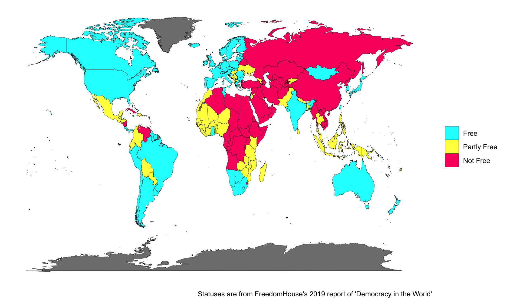

```{r setup, include=FALSE}
knitr::opts_chunk$set(echo = TRUE,
                      warning = FALSE)
library(tidyverse)
library(here)
library(kableExtra)
library(icons) 
library(countrycode)


fh_wb <- read_csv(here("content", "research", "democracy-reports", "files", "fh_wb.csv"))

all_countries <- unique(fh_wb$country)

allfiles <- list.files("files/reports")
goodfiles <- grep(list.files("files/reports"), pattern = "_files|.csv|.md", invert = TRUE)


dt_url <- vector(mode = "character", length = length(goodfiles))
count = 1
for (i in goodfiles) {
  dt_url[count] <- allfiles[i]
  count = count+1
}

dt_url <- paste("files/reports/", dt_url, sep = "")

all_countries <- all_countries %>%
                    sort()

```

## Democracy in the World
How does the health of democracy vary from country to country within a given continent? Using [FreedomHouse](https://freedomhouse.org/report/freedom-world) data from 1973-2019, I generated country profiles for all instances where data was available. The profiles also incorporate economic indicators from the [World Bank](https://data.worldbank.org/indicator).  

I am currently working to expand this analysis to include measurements of inequality, and to explore the relationship between income and democracy on a global scale.  

These profiles are fully reproducible. Check it out on `r  icons::fontawesome("github-alt")` [Github](https://github.com/davidicrabtree/democracy-reports).


```{r, echo=FALSE}

as_tibble(all_countries) %>%
  mutate("Country Profile" = cell_spec(value, "html", link = dt_url)) %>%
  mutate("Flag" = sprintf('', tolower(countrycode(all_countries, origin = "country.name", destination = "iso2c")))) %>%
  select(`Country Profile`, "Flag") %>%
  kable(format = "html", escape = FALSE, col.names = NULL) %>%
  kable_styling(bootstrap_options = c("hover", "striped", "condensed")) %>%
  scroll_box(width = "60%", height = "800px")


# all_countries %>%
#   cell_spec(row.names(.), "html", link = dt_url) %>%
#   kable("html", escape = FALSE, col.names =  "Country Profile") %>%
#   kable_styling(bootstrap_options = c("hover", "striped", "condensed")) %>%
#   scroll_box(width = "100%", height = "800px")

```


